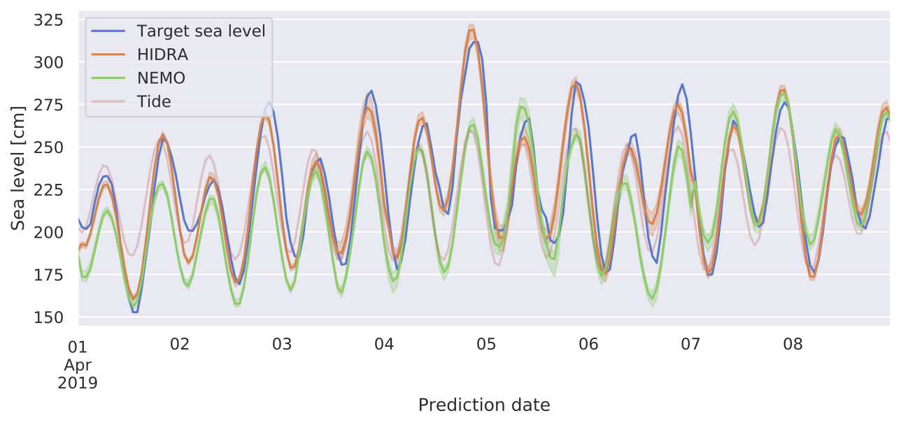

<p align="center">
    
</p>

# HIDRA 1.0: Deep-learning-based method for sea level forecasting

HIDRA is a state-of-the-art deep-learning model for sea level forecasting based on temporal atmospheric and sea level data.



### HIDRA in action

The most recent forecasts of the operational HIDRA model for the Koper Mareographic Station (northern Adriatic Sea), Slovenia are visualized at: [https://lojzezust.github.io/hidra-visualization](https://lojzezust.github.io/hidra-visualization)

## Setup

**Requires**: Python ≥ 3.6  
Clone the repository, then use `pip` to install HIDRA in the active Python enviroment.
```bash
git clone https://github.com/lojzezust/HIDRA.git
pip install HIDRA/
```

In you want to make changes to the HIDRA codebase, install the package in develop mode.
```bash
pip install -e HIDRA/
```

### GPU processing
To enable GPU training and inference the [TensorFlow requirements for GPU support](https://www.tensorflow.org/install/gpu#software_requirements) must be met, mainly:
- a CUDA® compatible card
- TensorFlow compatible CUDA® version (currently 10.1)
  
## Usage

HIDRA is implemented as a Tensorflow Keras model, which enables straight-forward training and inference.
```python
from hidra import HIDRA
model = HIDRA()

# Training
model.fit(...)

# Inference
model.predict(...)
```

A pretrained HIDRA model trained on Koper gauge station data is included in the repository. Please refer to the [HIDRA prediction example](examples/prediction.ipynb), showing how to use HIDRA with pretrained weights for sea level forecasting on sample data.

## Data preparation and training

To train a HIDRA model, prepare the training data, namely the atmospheric input, sea level input and target sea level tensors. In our setup we use HDF5 files with the following structure to store the training data.

| Field name | Shape | Description |
|---|----------------------|---|
| `weather` | N × (T<sub>max</sub> + T<sub>min</sub>)/4 × H × W × 4 | Atmospheric input tensors subsampled to a 4h temporal resolution. |
| `ssh`, `tide` & `delta` | N × T<sub>min</sub> × 1 | Sea level tensors (full, tidal component and residual component) |
| `lbl_ssh`, `lbl_tide` & `lbl_delta` | N × T<sub>max</sub> × 1 | Target (labels) sea level tensors (full, tidal component and residual component). |
| `dates` (optional) | N × T<sub>max</sub> | Timestamps corresponding to prediction times of labeled data (`lbl_*`) |

Here N defines the number of samples in the dataset, H and W define the spatial dimensions of the atmospheric data, T<sub>min</sub> and T<sub>max</sub> define the past and future horizons for HIDRA prediction. In our setup we provide the data for the last 24 hours (T<sub>min</sub> = 24) and predict the values for the next 72 hours (T<sub>max</sub> = 72).

All the features are standardized using the feature mean and standard deviation. These statistics are stored in the [summary file](data/summary.json) and are used for rescaling the predictions during test-time.

For additional information regarding the model training and data structure, please refer to the [HIDRA training example](examples/training.ipynb), detailing how to prepare and load the training data to train your own HIDRA model.
